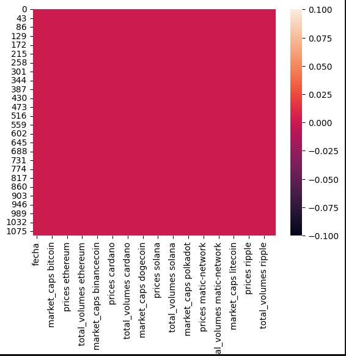
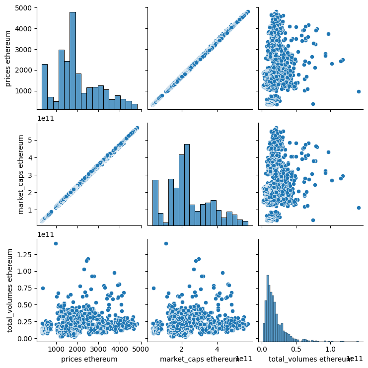

      
<h1 style="color:blueviolet">
<strong>PROYECTO INDIVIDUAL Nº2</strong>
</h1>
           
<h2 style="color:black">
Cryptocurrency Market Data Analytics
</h2>
    
<h3><strong>Conexión API CoinGecko - Generación Dataframe</strong></h3>

Para llevar a cabo el presente proyecto, se hace uso de la API de suo público que posee
CoinGecko, cuyo  objetivo es democratizar el acceso a las criptomonedas y dotar a los usuarios de información procesable. Asimismo,
indaga en el mundo de las criptomonedas para poder ofrecer información valiosa a sus usuarios a través de informes, publicaciones y boletines informativos sobre las criptomonedas, entre otros recursos.

Cuya documentación podemos encontrar en el siguiente enlace: <a href="https://www.coingecko.com/en/api/documentation">Documentación</a>

<ul>
<li style="text-align: justify;"> Se hace necesario entonces importar las librerias tanto de la API, como aquellas que nos permitirán hacer los análisis necesarios de los datos.</li>

<li style="text-align: justify;">Se procede entonces, a instanciar la función exportada de la libreria de CoinGecko
 definir el periodo sobre el cuál se hará el análisis de los datos.</li>

<li style="text-align: justify;"> Se define entonces la forma en la que se van a extraer los datos, para este caso se hace uso de una función, la cuál cuenta con los siguientes parámetros:</li>
<ol>
<li><strong>id_moneda:</strong> nombre de la moneda en página CoinGecko.</li>
<li><strong>vs_moneda:</strong> tipo de moneda en la que se traerá el valor de la misma.</li>
<li><strong>desde_fecha:</strong> fecha inicial.</li>
<li><strong>hasta_fecha:</strong> fecha final.</li>
<li><strong>precision:</strong>cantidad de decimales a tomar en cuenta.</li>

</ol>
<li>Se seleccionan las monedas que se van a emplear para el presente proyecto,
tomando como referencia el ranking de la página de CoinGecko, y otros artículos como los publicados por plus500.com y bussines inside.
</li>
<li>Se genera el dataframe con las siguientes variables por criptomoneda: precio, market cap y volumen total de transacción en unidades monetarias.</li>
</ul>
    
<h3><strong>EDA (Exploratory Data Analysis)</strong></h3>

Se procede a hacer uso de las funciones y gráficas pertinentes para hacer el análisis de los datos y llegar a las conclusiones necesarias para la toma de decisiones. Se evidencia lo siguiente:

<ul>
<li>No se encuentran valores nulos, ni duplicados dentro de las columnas o variables extraidas para generar el dataframe</li>

<h4>
fig.1 Heatmap - Valores nulos
</h4>

<li>Se evidencia la correlación positiva entre las variables precio y mercado de capitalización, mientras que en cuanto al total de transacciones no se observa que estas se encuentren relacionadas.</li>

<h4>
fig.2 Pairplot - Ethereum
</h4>

<li>Se procede a gráficar el comportamiento histórico de los precios de las monedas, mercado de capitalización, para evidenciar tendencias.</li>

<li>Se gráfican también los puntos máximos en cuanto a precios y volumen transaccional</li>
</ul>
    
<h3><strong>Conclusiones</strong></h3>

<ul>
<li>En conclusión podemos decir que los cambios que sufren las criptomonedas como bitcoin, ethereum, polkadot, cardano, binance, litecoin se encuentran estrechamente ligados, pues los mismos tienen un comportamiento similar historicamente.</li>

<li>Asimismo, se encuentran criptomonedas como solana y polkadot que presentan un comportamiento historico que difiere de las anterioemente mencionadas.</li>
            
<li>A pesar de las fluctuaciones presentadas históricamente, el valor de bitcoin y ethereum sigue siendo el más representativo en contraste con las otras monedas analizadas en el presente proyecto.</li>
            
<li>...</li>
</ul>
    

<h3><strong>KPI'S</strong></h3>
